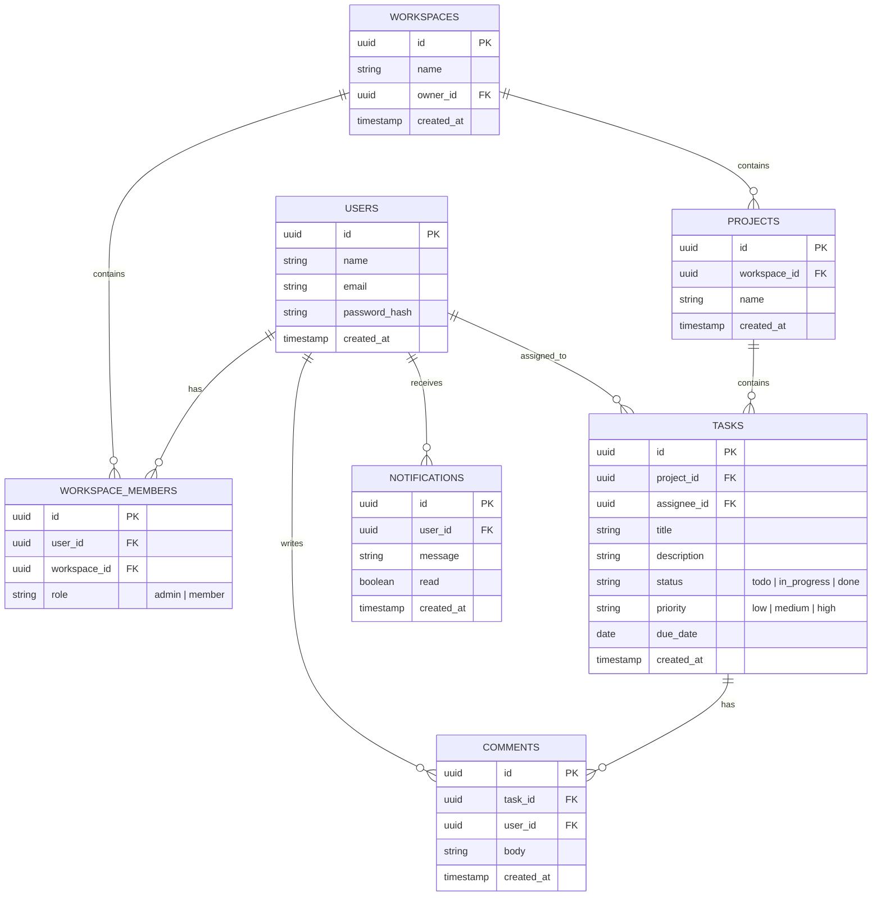

# Orbit — Entity Relationship Diagram

This diagram shows the core database schema for Orbit: users, workspaces, projects, tasks, comments, and notifications.

## Notes

- **WORKSPACE_MEMBERS** is a join table: one user can belong to many workspaces, and one workspace can have many users. The `role` column here drives role-based access control (Admin vs Member).
- **TASKS** is the central table — it links to a project (what it belongs to), an assignee (who owns it), and holds the fields the board UI and dashboard depend on (`status`, `priority`, `due_date`).
- **COMMENTS** and **NOTIFICATIONS** both reference `USERS` because we need to know who wrote a comment and who a notification is for.
- All primary keys use `uuid` rather than auto-increment integers — this avoids leaking sequential IDs (e.g. guessing `/tasks/43`) which matters for the broken-access-control requirement in Section 5.5.
